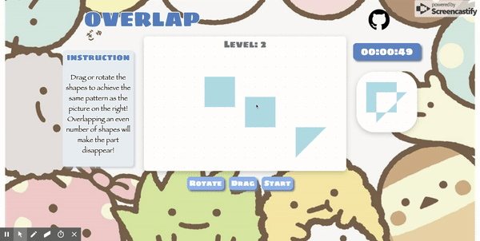
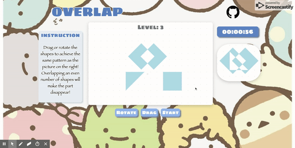

## Description

Overlap is a fully interactive JavaScript and HTML5 Canvas puzzle game that requires users to put multiple shapes together to form a shape that matches the model object given to them. Users can overlap the shapes to make some areas disappear.

## Features

- Allow user to move and rotate the shape smoothly, and to overlap different shapes together.

- Prompt win message when a level is completed.

- Start and end the timer as the round begin and finish.

## Highlights

### Move and Rotate

Using the mouse to select and move the shape or rotate the shape. When user releases the mouse, the shape will be calibrated to nearest grid point, giving the user a neater gaming experience. This is done by adding mouse up event listener to shape objects.

### Timer

Timer starts when a new round begins. When user achieves the given model object, a win message will prompt and the timer will stop simultaneously. This is done by utilizing the JavaScript getElementById and setTimeOut functions respectively.

## Languages

JavaScript, HTML5, CSS3
